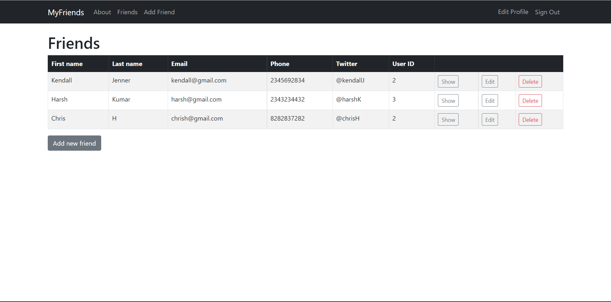
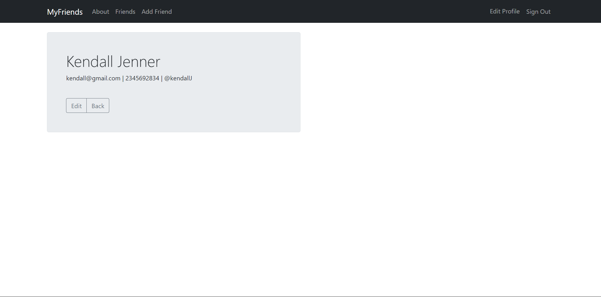
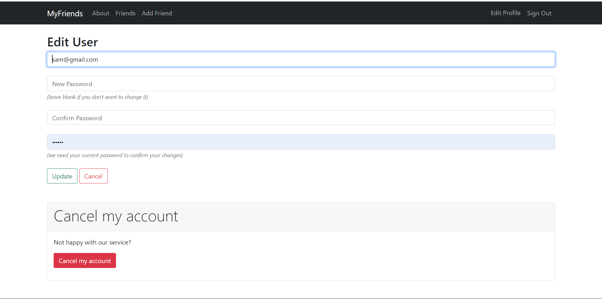

<!-- PROJECT LOGO -->
 

  <h3 align="start">Friends List</h3>

  

    A simple web app built with Ruby on Rails.
  

<!-- ABOUT THE PROJECT -->
## About The Project

  This is a my first ever project with Ruby on Rails. It's a simple web app with CRUD functionalities.

                                                                               
### Built With
* [Ruby](https://www.ruby-lang.org/en/)
* [Bootstrap](https://getbootstrap.com/)
* [RubyOnRails](https://rubyonrails.org/)

<!-- ACKNOWLEDGMENTS -->
## Acknowledgments

Thanks to the YouTube channel <a href="https://www.youtube.com/c/Codemycoms">Codemy.com<a/a> for the tutorials.

